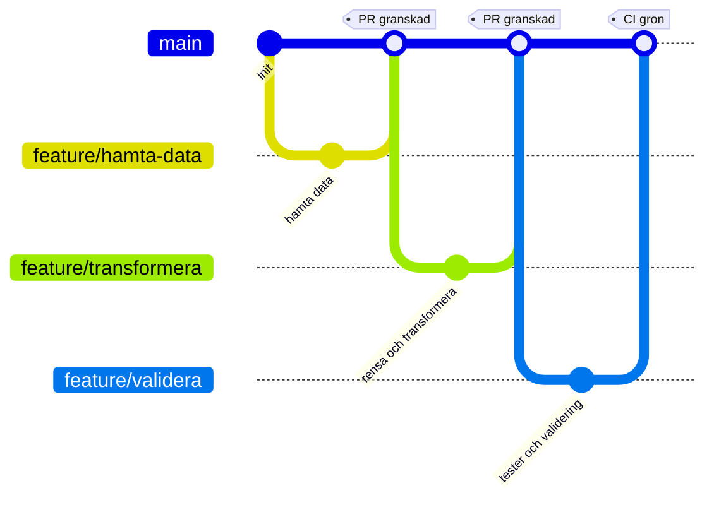

<div align="center">

# CI/CD Grupparbete

### Grupp 7 &nbsp;&bull;&nbsp; DevOps &nbsp;&bull;&nbsp; DE25

<p>


</p>

<em>Ett sammanhängande samarbetsprojekt där hela gruppen bygger en dataingestion pipeline tillsammans<br>
med parallella branches, pull requests, kodgranskning och en gemensam CI/CD pipeline.</em>

</div>

***

## Innehåll

1. [Syfte](#syfte)
2. [Mål](#mål)
3. [Tema](#tema)
4. [Arbetsflöde i Git](#arbetsflöde-i-git)
5. [Rollfördelning](#rollfördelning)
6. [Kom igång](#kom-igång)
7. [Projektstruktur](#projektstruktur)
8. [Secrets och lokal konfiguration](#secrets-och-lokal-konfiguration)
9. [CI/CD pipeline](#cicd-pipeline)
10. [Datakällor](#datakällor)
11. [Presentation, Lektion 8](#presentation-lektion-8)
12. [Bedömning](#bedömning)
13. [Gruppmedlemmar](#gruppmedlemmar)
14. [Rollbeskrivningar](#rollbeskrivningar)

***

## Syfte

Ge studenterna möjlighet att tillämpa kursens moment i ett sammanhängande, äkta samarbetsprojekt, alltså inte isolerade övningar, och öva verkligt teamarbete med Git och GitHub: parallella branches, pull requests, kodgranskning och en gemensam CI/CD pipeline.

***

## Mål

Vid presentationen ska gruppen kunna visa:

<table>
<tr>
<td width="34"><b>1</b></td>
<td>Ett GitHub repository med en <code>main</code> branch och en egen feature branch per gruppmedlem</td>
</tr>
<tr>
<td><b>2</b></td>
<td>En fungerande CI pipeline i GitHub Actions som automatiskt kör vid push och pull request</td>
</tr>
<tr>
<td><b>3</b></td>
<td>Korrekt hantering av secrets och lokal konfiguration via <code>.gitignore</code> och <code>.env</code>, utan att känslig information hamnar i repot</td>
</tr>
<tr>
<td><b>4</b></td>
<td>Ett fungerande samarbetsflöde: pull requests med granskning innan merge till <code>main</code></td>
</tr>
</table>

***

## Tema

Gruppen bygger en enkel dataingestion pipeline kring en valfri datakälla, till exempel ett öppet API, en CSV fil eller enkel webscraping.

**Krav**

* Kod versionshanteras i ett gemensamt GitHub repo
* En `main` branch plus en feature branch per gruppmedlem, naturligt uppdelat per steg i pipelinen
* `.gitignore` och `.env` används korrekt och skyddar till exempel nycklar till API eller uppgifter till en databas
* CI/CD pipeline som automatiskt kör lintning och tester vid push och pull request, till exempel tester i pytest som validerar att pipelinen producerar korrekt strukturerad data

**Valfritt**

* Schemaläggning och driftsättning är inget krav, men får gärna göras

***

## Arbetsflöde i Git



**Så jobbar vi**

1. Skapa din egen feature branch från `main`
2. Commita ofta och med tydliga meddelanden
3. Pusha upp branchen och öppna en pull request mot `main`
4. Vänta in CI, alla kontroller ska vara gröna
5. Be en gruppmedlem granska och godkänna
6. Merga till `main` och radera branchen

<details>
<summary><b>Kommandon steg för steg</b></summary>

```bash
git checkout main
git pull origin main
git checkout -b feature/mitt-omrade

git add .
git commit -m "Beskriv vad som gjorts"
git push -u origin feature/mitt-omrade
```

När en merge konflikt uppstår:

```bash
git checkout main
git pull origin main
git checkout feature/mitt-omrade
git merge main
# lös konflikterna i filerna, spara, och kör sedan
git add .
git commit
git push
```

</details>

> [!TIP]
> Gruppen bör medvetet dela en gemensam fil, till exempel `requirements.txt` eller en statusfil, så att merge konflikter uppstår naturligt och inte bara av tur.

***

## Rollfördelning

Arbetet delas upp per steg i pipelinen, en person per steg. Gruppen består av sex personer, därför är CI/CD och konfiguration egna ansvarsområden. Båda ingår i det som bedöms, och utan en tydlig ägare blir de lätt ingens ansvar.

<table>
<thead>
<tr><th align="left">Nr</th><th align="left">Steg</th><th align="left">Ansvar</th><th align="left">Branch</th><th align="left">Svårighetsgrad</th></tr>
</thead>
<tbody>
<tr><td><b>1</b></td><td><b><a href="#1-hämta-data">Hämta data</a></b></td><td>Anropa källan och spara rådata</td><td><code>feature/hamta-data</code></td><td>Lätt till medel</td></tr>
<tr><td><b>2</b></td><td><b><a href="#2-rensa-och-transformera">Rensa och transformera</a></b></td><td>Städa fält, typer och format</td><td><code>feature/transformera</code></td><td>Medel</td></tr>
<tr><td><b>3</b></td><td><b><a href="#3-validera-och-testa">Validera och testa</a></b></td><td>Tester i pytest och kontroll av struktur</td><td><code>feature/validera</code></td><td>Medel</td></tr>
<tr><td><b>4</b></td><td><b><a href="#4-sammanställa-resultat">Sammanställa resultat</a></b></td><td>Slutlig utdata och sammanfattning</td><td><code>feature/resultat</code></td><td>Lätt till medel</td></tr>
<tr><td><b>5</b></td><td><b><a href="#5-cicd-pipeline">CI/CD pipeline</a></b></td><td>Bygga workflowen i GitHub Actions och få den grön</td><td><code>feature/ci</code></td><td>Medel till svår</td></tr>
<tr><td><b>6</b></td><td><b><a href="#6-konfiguration-och-secrets">Konfiguration och secrets</a></b></td><td>Hålla ihop <code>.env.example</code>, <code>.gitignore</code> och secrets i GitHub</td><td><code>feature/konfig</code></td><td>Lätt</td></tr>
</tbody>
</table>

Klicka på ett steg i tabellen för att läsa den fullständiga [rollbeskrivningen](#rollbeskrivningar) längst ned.

**Ordning**

Steg 5 och 6 bör mergas först, helst redan första dagen. CI måste finnas på plats innan någon annans pull request kan bli grön. Därefter steg 1, och därnäst steg 2, 3 och 4 parallellt.

> [!NOTE]
> Svårighetsgraden påverkar inte betyget. Bedömningen gäller processen: egen branch, pull request med granskning, en löst merge konflikt och en grön CI körning. Den som tar det enklaste steget får samma G som den som tar det svåraste.

***

## Kom igång

```bash
git clone https://github.com/GHT4ngo/cicd-grupparbete-grupp7.git
cd cicd-grupparbete-grupp7

python3 -m venv .venv            # Windows: py -m venv .venv
source .venv/bin/activate        # Windows: .venv\Scripts\activate

pip install -r requirements.txt
cp .env.example .env             # fyll i dina egna värden
```

> [!NOTE]
> På Linux och macOS heter kommandot `python3`, inte `python`. Kommandot `py` är en Windows-specifik launcher och finns inte på Linux.

Kör pipelinen och testerna lokalt:

```bash
python -m src.main               # när .venv är aktiverad räcker python
ruff check .
pytest
```

Nya beroenden läggs till i `requirements.txt` och committas, så att alla i gruppen och CI kör samma paket.

***

## Projektstruktur

Så här ser repot ut när alla sex steg är mergade till `main`.

```text
cicd-grupparbete-grupp7/
├── .github/
│   └── workflows/
│       └── ci.yml            # steg 5, lint och test vid push och pull request
├── data/
│   ├── raw/                  # rådata från källan, gitignorerad
│   └── output.json           # slutlig utdata, sökväg från OUTPUT_PATH
├── src/
│   ├── __init__.py
│   ├── main.py               # kör hela pipelinen från början till slut
│   ├── hamta.py              # steg 1
│   ├── transformera.py       # steg 2
│   └── resultat.py           # steg 4
├── tests/
│   ├── __init__.py
│   └── test_pipeline.py      # steg 3
├── .env                      # lokala värden, committas aldrig
├── .env.example              # mall med tomma platshållare
├── .gitignore
├── README.md
└── requirements.txt
```

> [!NOTE]
> I repot finns just nu `.env.example`, `.gitignore`, `README.md` och `requirements.txt`. Mapparna `src/`, `tests/`, `data/` och `.github/` skapas av respektive roll i den egna feature branchen.

Filnamn i `src/` skrivs utan å, ä och ö, eftersom modulnamn importeras i kod. Därför `hamta.py` och inte `hämta.py`.

***

## Secrets och lokal konfiguration

> [!IMPORTANT]
> Filen `.env` ska aldrig committas. Endast `.env.example` ligger i repot, och den innehåller tomma platshållare.

**`.env.example`**

```dotenv
API_KEY=
API_BASE_URL=
OUTPUT_PATH=data/output.json
```

**`.gitignore`**

```gitignore
# Miljovariabler
.env

# Virtuell miljo
.venv/
venv/

# Python
__pycache__/
*.pyc
.pytest_cache/
.ruff_cache/

# Data
data/raw/

# AI-assistenter
CLAUDE.md
AGENTS.md
.claude/

# Editor och OS
.vscode/
.idea/
.DS_Store
```

Nycklar som behövs i CI läggs in under **Settings → Secrets and variables → Actions** i GitHub och läses in i workflowen som `${{ secrets.API_KEY }}`.

***

## CI/CD pipeline

Pipelinen körs automatiskt vid varje push och vid varje pull request mot `main`.

<table>
<thead>
<tr><th align="left">Steg</th><th align="left">Vad som händer</th><th align="left">Verktyg</th></tr>
</thead>
<tbody>
<tr><td><b>Checkout</b></td><td>Hämtar koden till körningen</td><td>actions/checkout</td></tr>
<tr><td><b>Setup</b></td><td>Installerar Python och beroenden</td><td>actions/setup&#8203;python</td></tr>
<tr><td><b>Lint</b></td><td>Kontrollerar kodstil och uppenbara fel</td><td>ruff eller flake8</td></tr>
<tr><td><b>Test</b></td><td>Kör testsviten och validerar datastrukturen</td><td>pytest</td></tr>
</tbody>
</table>

En pull request får mergas först när alla steg är gröna och en gruppmedlem har godkänt granskningen.

***

## Datakällor

Gruppen väljer **en** av dessa källor.

<table>
<thead>
<tr><th align="left">Källa</th><th align="left">Format</th><th align="left">Dokumentation</th></tr>
</thead>
<tbody>
<tr>
  <td><b>REST Countries</b></td><td>JSON</td>
  <td><a href="https://restcountries.com/docs/countries#list">restcountries.com</a></td>
</tr>
<tr>
  <td><b>PokéAPI</b></td><td>JSON</td>
  <td><a href="https://pokeapi.co/docs/v2">pokeapi.co</a>, leta gärna efter en version för Python, det finns publika repon</td>
</tr>
<tr>
  <td><b>CoinGecko</b></td><td>JSON</td>
  <td><a href="https://docs.coingecko.com/docs/setting-up-your-api-key">docs.coingecko.com</a>, gratis nyckel finns</td>
</tr>
<tr>
  <td><b>Trafiklab, SL med flera</b></td><td>JSON</td>
  <td><a href="https://www.trafiklab.se/sv/api/our-apis/sl/">trafiklab.se</a>, dokumentationen verkar vara på engelska</td>
</tr>
<tr>
  <td><b>Riksdagens öppna data</b></td><td>JSON</td>
  <td><a href="https://www.riksdagen.se/sv/dokument-och-lagar/riksdagens-oppna-data/">riksdagen.se</a></td>
</tr>
<tr>
  <td><b>SCB, Statistikmyndigheten</b></td><td>JSON</td>
  <td><a href="https://www.scb.se/vara-tjanster/oppna-data/">scb.se</a></td>
</tr>
<tr>
  <td><b>Nyheter via RSS</b></td><td>XML</td>
  <td>Den enda källan som inte är ett API i JSON, koden ser därför annorlunda ut, till exempel <code>feedparser</code> i stället för <code>requests</code></td>
</tr>
</tbody>
</table>

<details>
<summary><b>Flöden för nyheter via RSS</b></summary>

* SVT Nyheter: https://www.svt.se/nyheter/lokalt/jamtland/nyheterna-direkt-till-din-dator
* Dagens Nyheter: https://www.dn.se/rss/
* Aftonbladet: https://rss.aftonbladet.se/rss2/small/pages/sections/senastenytt/
* Expressen
* SvD

</details>

***

## Presentation, Lektion 8

En kort demo per grupp på cirka **20 minuter**:

1. Genomgång av repot
2. Historiken över branches
3. En granskning av en pull request i praktiken
4. CI pipelinen som körs live

Avsluta med en kort reflektion: vilka moment inom DevOps användes, och vilka utmaningar stötte gruppen på.

***

## Bedömning

**Grupparbete, betygsskala G eller IG.** För att få **G** behöver du delta i samtliga moment:

* [ ] Skapa en egen feature branch för din del av arbetet
* [ ] Genomföra din del av uppgiften, till exempel hämta data, rensa och transformera, validera och testa, eller sammanställa resultat
* [ ] Merga din feature branch till `main` efter granskning via pull request
* [ ] Hantera en merge konflikt om eller när en sådan uppstår under arbetets gång
* [ ] Delta i hanteringen av `.gitignore` och `.env`, antingen genom att själv konfigurera dem eller genom att aktivt bevittna och förstå hur gruppen gjort det
* [ ] Din pull request ska ha triggat en körning i CI, alltså lintning och tester, som blev grön innan merge

> [!NOTE]
> Datakvalitet och helhetslösning bedöms inte. Det avgörande är att du har deltagit i processen kring CI/CD.

***

## Gruppmedlemmar

<table>
<thead>
<tr><th align="left">Namn</th><th align="left">GitHub</th><th align="left">Ansvarsområde</th></tr>
</thead>
<tbody>
<tr><td></td><td></td><td><a href="#1-hämta-data">Hämta data</a></td></tr>
<tr><td></td><td></td><td><a href="#2-rensa-och-transformera">Rensa och transformera</a></td></tr>
<tr><td></td><td></td><td><a href="#3-validera-och-testa">Validera och testa</a></td></tr>
<tr><td></td><td></td><td><a href="#4-sammanställa-resultat">Sammanställa resultat</a></td></tr>
<tr><td></td><td></td><td><a href="#5-cicd-pipeline">CI/CD pipeline</a></td></tr>
<tr><td></td><td></td><td><a href="#6-konfiguration-och-secrets">Konfiguration och secrets</a></td></tr>
</tbody>
</table>

***

## Rollbeskrivningar

Varje roll beskrivs efter samma mall: vad rollen gör, vad som ska levereras, vad nästa steg får, och när rollen är klar. Läs din egen noggrant och skumma de andra, så vet du vem du tar emot ifrån och vem du lämnar över till.

Alla roller arbetar i en egen branch enligt [Arbetsflöde i Git](#arbetsflöde-i-git), och allt går in i `main` via en pull request som en gruppmedlem har granskat.

<br>

### 1. Hämta data

> **Branch** `feature/hamta-data` &nbsp;&bull;&nbsp; **Levererar** `src/hamta.py` &nbsp;&bull;&nbsp; **Svårighetsgrad** Lätt till medel

Första steget i pipelinen. Rollen kontaktar den valda källan och hämtar hem rådata precis som den ser ut, utan att tolka eller städa den. Allt som handlar om hur ett anrop går till bor här: adress, parametrar, hur svaret sparas och vad som händer när källan inte svarar.

**Ska levereras**

* En funktion `hamta_data()` som returnerar rådata från källan
* Rådata sparad under `data/raw/`, så att övriga kan arbeta utan att anropa källan om och om igen
* `API_BASE_URL` och eventuell `API_KEY` läses från `.env`, aldrig skrivna direkt i koden
* Enkel felhantering: timeout, statuskod som inte är 200, och tomt svar

**Nästa steg får** rådata i källans eget format, till exempel en lista med dictionaries från JSON.

**Klar när** en körning ger en sparad fil med rådata, steg 2 kan utgå från ett känt format, och CI är grön.

> [!TIP]
> Hämta ett litet urval under utvecklingen, till exempel tio poster. Många öppna API:er har en gräns för antal anrop per minut.

<br>

### 2. Rensa och transformera

> **Branch** `feature/transformera` &nbsp;&bull;&nbsp; **Levererar** `src/transformera.py` &nbsp;&bull;&nbsp; **Svårighetsgrad** Medel

Rollen tar emot rådata och gör den användbar. Här bestäms hur den färdiga datastrukturen ser ut, vilket i praktiken är pipelinens viktigaste överenskommelse: steg 3 testar den och steg 4 bygger sitt resultat på den. Prata med båda innan strukturen spikas.

**Ska levereras**

* En funktion `transformera(radata)` som returnerar en lista med rensade poster
* Fältnamn normaliserade till ett konsekvent format, till exempel gemener med understreck
* Typer satta medvetet: tal som `int` eller `float`, datum i ett bestämt format, text utan inledande och avslutande blanksteg
* Poster som saknar obligatoriska fält hanteras enligt en uttalad regel, antingen bortsorterade eller ifyllda med ett standardvärde
* Dubbletter borttagna

**Nästa steg får** en lista med poster som har samma fält, samma typer och inga överraskningar.

**Klar när** strukturen är dokumenterad i en kort kommentar eller docstring, steg 3 har tester som passerar mot den, och CI är grön.

<br>

### 3. Validera och testa

> **Branch** `feature/validera` &nbsp;&bull;&nbsp; **Levererar** `tests/` &nbsp;&bull;&nbsp; **Svårighetsgrad** Medel

Rollen äger testsviten och är den som säger ifrån när något går sönder. Fokus ligger på strukturen i utdatan från steg 2, alltså att pipelinen producerar korrekt formad data, inte att innehållet råkar vara vackert.

**Ska levereras**

* Tester i pytest under `tests/`, körbara med enbart `pytest`
* Kontroller av att varje post har alla obligatoriska fält, att typerna stämmer, och att listan inte är tom
* Minst ett test som fångar ett verkligt felfall, till exempel en post där ett fält saknas
* En liten fixtur med sparad exempeldata, så att testerna kan köras utan nätverk

**Nästa steg får** en grön testsvit som skyddar hela gruppens arbete vid varje pull request.

**Klar när** `pytest` går igenom lokalt, testerna körs automatiskt i CI, och ett medvetet infört fel faktiskt får dem att fallera.

> [!IMPORTANT]
> Testerna får inte anropa det riktiga API:et. CI körs på en maskin utan dina nycklar, och ett test som beror på nätverket blir rött av fel anledning.

<br>

### 4. Sammanställa resultat

> **Branch** `feature/resultat` &nbsp;&bull;&nbsp; **Levererar** `src/resultat.py` och `src/main.py` &nbsp;&bull;&nbsp; **Svårighetsgrad** Lätt till medel

Sista steget i pipelinen. Rollen tar den rensade datan och gör något begripligt av den, samt knyter ihop hela kedjan i `src/main.py` så att en enda körning går från hämtning till färdig fil.

**Ska levereras**

* En funktion som skriver slutresultatet till sökvägen i `OUTPUT_PATH`, som standard `data/output.json`
* En kort sammanfattning: antal poster, tidpunkt för körningen, och ett par enkla nyckeltal som är relevanta för den valda källan
* `src/main.py` som kör stegen i ordning: hämta, transformera, sammanställ
* Utskrift i terminalen som visar att körningen lyckades

**Nästa steg får** det som visas under presentationen i Lektion 8.

**Klar när** `python -m src.main` producerar en färdig utdatafil från ett tomt tillstånd, och CI är grön.

<br>

### 5. CI/CD pipeline

> **Branch** `feature/ci` &nbsp;&bull;&nbsp; **Levererar** `.github/workflows/ci.yml` &nbsp;&bull;&nbsp; **Svårighetsgrad** Medel till svår

Rollen bygger den automatik som alla andras pull requests mäts mot. Den här rollen arbetar först, gärna redan första dagen, eftersom ingen annans pull request kan bli grön innan workflowen finns i `main`.

**Ska levereras**

* En workflow som körs vid `push` och vid `pull_request` mot `main`
* Stegen checkout, uppsättning av Python, installation av `requirements.txt`, `ruff check .` och `pytest`
* Körningen använder samma Python-version som gruppen kör lokalt
* Eventuella nycklar läses in från GitHub Secrets som `${{ secrets.API_KEY }}`, aldrig från en fil i repot

**Nästa steg får** ett grönt eller rött besked på varje pull request, automatiskt.

**Klar när** märket för workflowen visar grönt på `main`, och en avsiktligt trasig commit i en testbranch faktiskt gör körningen röd.

> [!TIP]
> Föreslå för gruppen att `main` skyddas under **Settings → Branches**, med krav på grön CI och en godkänd granskning innan merge. Då blir kraven i [Bedömning](#bedömning) något som repot upprätthåller av sig självt.

<br>

### 6. Konfiguration och secrets

> **Branch** `feature/konfig` &nbsp;&bull;&nbsp; **Levererar** `.gitignore`, `.env.example` och `requirements.txt` &nbsp;&bull;&nbsp; **Svårighetsgrad** Lätt

Rollen ser till att ingen känslig information hamnar i repot och att alla kan sätta upp projektet på samma sätt. Liten i kodmängd, men det är den här rollen som bedöms i punkten om `.gitignore` och `.env`, och den arbetar parallellt med steg 5 i början av projektet.

**Ska levereras**

* Ett `.gitignore` som täcker `.env`, `.venv/`, `__pycache__/`, cache från test och lint, samt `data/raw/`
* Ett `.env.example` med alla variabler som koden faktiskt läser, med tomma värden
* `requirements.txt` som hålls uppdaterad när någon lägger till ett paket
* Motsvarande nycklar upplagda under **Settings → Secrets and variables → Actions** i GitHub

**Nästa steg får** ett repo där `git clone` följt av stegen i [Kom igång](#kom-igång) räcker för att komma igång.

**Klar när** `git status` är ren efter en full körning, ingen nyckel finns i historiken, och en gruppmedlem har kunnat sätta upp projektet från grunden enbart med hjälp av README.

> [!IMPORTANT]
> Om en nyckel råkar committas är det inte nog att ta bort den i nästa commit. Den ligger kvar i historiken. Spärra nyckeln hos leverantören och skapa en ny.

<div align="center">
<sub>DevOps DE25 &nbsp;&bull;&nbsp; Grupp 7</sub>
</div>
