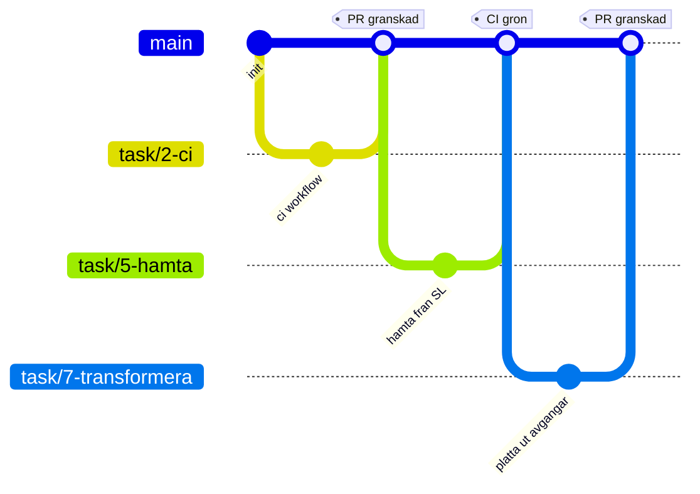

<div align="center">

# CI/CD Grupparbete

### Grupp 7 &nbsp;&bull;&nbsp; DevOps &nbsp;&bull;&nbsp; DE25

<p>


</p>

<em>Ett sammanhängande samarbetsprojekt där hela gruppen bygger en dataingestion pipeline tillsammans<br>
med parallella branches, pull requests, kodgranskning och en gemensam CI/CD pipeline.</em>

</div>

***

## Innehåll

1. [Syfte](#syfte)
2. [Mål](#mål)
3. [Tema](#tema)
4. [Arbetsflöde i Git](#arbetsflöde-i-git)
5. [Arbetsfördelning](#arbetsfördelning)
6. [Kom igång](#kom-igång)
7. [Projektstruktur](#projektstruktur)
8. [Datakontraktet](#datakontraktet)
9. [Secrets och lokal konfiguration](#secrets-och-lokal-konfiguration)
10. [CI/CD pipeline](#cicd-pipeline)
11. [Datakällor](#datakällor)
12. [Presentation, Lektion 8](#presentation-lektion-8)
13. [Bedömning](#bedömning)
14. [Gruppmedlemmar](#gruppmedlemmar)
15. [Vad varje uppgift går ut på](#vad-varje-uppgift-går-ut-på)

***

## Syfte

Ge studenterna möjlighet att tillämpa kursens moment i ett sammanhängande, äkta samarbetsprojekt, alltså inte isolerade övningar, och öva verkligt teamarbete med Git och GitHub: parallella branches, pull requests, kodgranskning och en gemensam CI/CD pipeline.

***

## Mål

Vid presentationen ska gruppen kunna visa:

<table>
<tr>
<td width="34"><b>1</b></td>
<td>Ett GitHub repository med en <code>main</code> branch och en egen feature branch per gruppmedlem</td>
</tr>
<tr>
<td><b>2</b></td>
<td>En fungerande CI pipeline i GitHub Actions som automatiskt kör vid push och pull request</td>
</tr>
<tr>
<td><b>3</b></td>
<td>Korrekt hantering av secrets och lokal konfiguration via <code>.gitignore</code> och <code>.env</code>, utan att känslig information hamnar i repot</td>
</tr>
<tr>
<td><b>4</b></td>
<td>Ett fungerande samarbetsflöde: pull requests med granskning innan merge till <code>main</code></td>
</tr>
</table>

***

## Tema

Gruppen bygger en enkel dataingestion pipeline kring en valfri datakälla, till exempel ett öppet API, en CSV fil eller enkel webscraping.

**Krav**

* Kod versionshanteras i ett gemensamt GitHub repo
* En `main` branch plus en feature branch per gruppmedlem, naturligt uppdelat per steg i pipelinen
* `.gitignore` och `.env` används korrekt och skyddar till exempel nycklar till API eller uppgifter till en databas
* CI/CD pipeline som automatiskt kör lintning och tester vid push och pull request, till exempel tester i pytest som validerar att pipelinen producerar korrekt strukturerad data

**Valfritt**

* Schemaläggning och driftsättning är inget krav, men får gärna göras

***

## Arbetsflöde i Git



**Så jobbar vi**

1. Ta ett kort i [projekttavlan](../../projects) och tilldela dig själv
2. Skapa en branch från `main` som heter `task/16-linjefarger`, alltså numret plus ett kort namn
3. Commita ofta och med tydliga meddelanden
4. Pusha upp branchen och öppna en pull request mot `main`, med `Closes #16` i beskrivningen
5. Vänta in CI, alla kontroller ska vara gröna
6. Be en gruppmedlem granska och godkänna
7. Merga till `main` och radera branchen

Tack vare `Closes #16` stängs issuet av sig självt när pull requesten mergas, och kortet flyttar sig till **Done**. Ingen behöver hålla en lista uppdaterad för hand.

<details>
<summary><b>Kommandon steg för steg</b></summary>

```bash
git checkout main
git pull origin main
git checkout -b feature/mitt-omrade

git add .
git commit -m "Beskriv vad som gjorts"
git push -u origin feature/mitt-omrade
```

När en merge konflikt uppstår:

```bash
git checkout main
git pull origin main
git checkout feature/mitt-omrade
git merge main
# lös konflikterna i filerna, spara, och kör sedan
git add .
git commit
git push
```

</details>

> [!TIP]
> Gruppen bör medvetet dela en gemensam fil så att merge konflikter uppstår naturligt och inte bara av tur. Det är därför [uppgift 28](../../issues/36) tas av alla sex: var och en lägger till sin egen rad i tabellen [Gruppmedlemmar](#gruppmedlemmar), i sin egen branch.

***

## Arbetsfördelning

Vi har **inga fasta roller**. Arbetet ligger som en kö av små uppgifter, ett issue per uppgift, med korten i [projekttavlan](../../projects).

Var och en tar så många uppgifter hen vill, i sin egen takt. Dra ett kort till **In progress**, gör uppgiften i en egen branch, och skriv `Closes #16` i din pull request. Då stängs kortet av sig självt när den mergas.

<table>
<thead>
<tr><th align="left">Hög</th><th align="left">Antal</th><th align="left">Vad det är</th></tr>
</thead>
<tbody>
<tr><td><b>Kärnan</b></td><td>17</td><td>Det som måste bli gjort för att projektet ska fungera och alla bli godkända</td></tr>
<tr><td><b>Bonus</b></td><td>13</td><td>Helt frivilligt, tas när kärnan är i hamn</td></tr>
</tbody>
</table>

Sjutton kärnuppgifter fördelat på sex personer blir under tre var.

> [!NOTE]
> Tidigare låg här ett förslag med sex fasta roller. Det byttes mot en uppgiftstavla eftersom en otagen roll blockerade allt nedanför sig. Nu kan de flesta uppgifter tas i vilken ordning som helst.

## Kom igång

```bash
git clone https://github.com/GHT4ngo/cicd-grupparbete-grupp7.git
cd cicd-grupparbete-grupp7

python3 -m venv .venv            # Windows: py -m venv .venv
source .venv/bin/activate        # Windows: .venv\Scripts\activate

pip install -r requirements.txt
cp .env.example .env             # fyll i dina egna värden
```

> [!NOTE]
> På Linux och macOS heter kommandot `python3`, inte `python`. Kommandot `py` är en Windows-specifik launcher och finns inte på Linux.

Kör pipelinen och testerna lokalt:

```bash
python -m src.main               # när .venv är aktiverad räcker python
ruff check .
pytest
```

Nya beroenden läggs till i `requirements.txt` och committas, så att alla i gruppen och CI kör samma paket.

***

## Projektstruktur

Så här ser repot ut när alla uppgifter är mergade till `main`. Siffrorna hänvisar till [TASKS.md](TASKS.md).

```text
cicd-grupparbete-grupp7/
├── .github/
│   └── workflows/
│       └── ci.yml            # 2, lint och test vid push och pull request
├── data/
│   └── raw/                  # rådata från källan, gitignorerad
├── docs/                     # 29, publiceras av Cloudflare
│   ├── index.html            # 12 och 13, avgångstavlan i webbläsaren
│   └── data/
│       ├── avgangar.json     # 11, sökväg från OUTPUT_PATH
│       └── hallplatser.json  # 32, sökväg från STATIONER_PATH
├── presentation/             # redovisningen, lektion 8
│   ├── index.html            # bildspelet, öppnas direkt i webbläsaren
│   └── manus.md              # vem säger vad, tider och live-demona
├── src/
│   ├── __init__.py           # 1
│   ├── main.py               # 14 och 21, kör hela kedjan
│   ├── config.py             # 3
│   ├── hamta.py              # 5
│   ├── transformera.py       # 7, 8 och 9
│   ├── validera.py           # 10
│   ├── resultat.py           # 11
│   ├── stationer.py          # 15 och 32
│   ├── linjer.py             # 16
│   ├── avvikelser.py         # 17
│   ├── tid.py                # 18
│   ├── statistik.py          # 19
│   └── filter.py             # 20
├── tests/
│   ├── __init__.py           # 1
│   ├── exempel/              # 6, sparat svar som testerna kör mot
│   └── test_*.py             # 22 till 27, ett test per modul
├── .env                      # lokala värden, committas aldrig
├── .env.example              # mall med tomma platshållare
├── .gitignore
├── EXAMINATION.md            # checklista för den individuella examinationen
├── README.md
├── SUGGESTION.md             # vad vi bygger och hur API:et fungerar
├── TASKS.md                  # uppgiftstavlan, ta en uppgift här
├── requirements.txt
└── wrangler.jsonc            # talar om för Cloudflare att docs ska publiceras
```

> [!NOTE]
> Mergat till `main` just nu: uppgift 1, 2, 3, 5, 6, 7, 8, 9, 10, 11, 12, 13, 15, 18, 19, 29 och 30. Uppgift 14 ligger i en öppen pull request. Kvar att skapa är `src/main.py`, `src/linjer.py`, `src/avvikelser.py`, `src/filter.py`, `docs/data/hallplatser.json` och testerna 22 till 27 samt 31. Filerna skapas av den som tar respektive uppgift, i sin egen branch.

Filnamn i `src/` skrivs utan å, ä och ö, eftersom modulnamn importeras i kod. Därför `hamta.py` och inte `hämta.py`.

***

## Datakontraktet

Så här ser en avgång ut när den kommit igenom pipelinen. Åtta fält, alla platta, inga nästlade objekt.

```json
{
  "linje": "14",
  "linjegrupp": "Tunnelbanans röda linje",
  "transportmedel": "METRO",
  "riktning_kod": 2,
  "riktning": "Fruängen",
  "destination": "Liljeholmen",
  "avgar_klocka": "13:22",
  "minuter": 3
}
```

> [!IMPORTANT]
> Kontraktet är det som gör att flera personer kan jobba samtidigt utan att prata med varandra. Uppgift 7 fyller fälten, uppgift 10 kontrollerar dem och uppgift 12 visar dem. Så länge alla håller sig till namnen ovan spelar det ingen roll vem som blir klar först.

<table>
<thead>
<tr><th align="left">Fält</th><th align="left">Kommer från</th><th align="left">Exempel</th></tr>
</thead>
<tbody>
<tr><td><code>linje</code></td><td><code>line.designation</code></td><td>14</td></tr>
<tr><td><code>linjegrupp</code></td><td><code>line.group_of_lines</code></td><td>Tunnelbanans röda linje</td></tr>
<tr><td><code>transportmedel</code></td><td><code>line.transport_mode</code></td><td>METRO, BUS, TRAIN, TRAM, SHIP</td></tr>
<tr><td><code>riktning_kod</code></td><td><code>direction_code</code></td><td>1 eller 2</td></tr>
<tr><td><code>riktning</code></td><td><code>direction</code></td><td>Fruängen</td></tr>
<tr><td><code>destination</code></td><td><code>destination</code></td><td>Liljeholmen</td></tr>
<tr><td><code>avgar_klocka</code></td><td><code>expected</code>, klockslaget</td><td>13:22</td></tr>
<tr><td><code>minuter</code></td><td>uträknat från <code>expected</code></td><td>3</td></tr>
</tbody>
</table>

> [!WARNING]
> Räkna alltid ut `minuter` själv från `expected`. Fältet `display` som API:et skickar blandar `"Nu"`, `"3 min"` och `"13:25"` i samma svar, eftersom det växlar till klockslag efter ungefär tio minuter.

***

## Secrets och lokal konfiguration

> [!IMPORTANT]
> Filen `.env` ska aldrig committas. Endast `.env.example` ligger i repot.

**`.env.example`**

```dotenv
SITE_ID=9192
SITE_NAME=Slussen
TRANSPORT_MODE=METRO
FORECAST_MINUTES=60
OUTPUT_PATH=docs/data/avgangar.json
```

> [!NOTE]
> **SL Transport kräver ingen API nyckel.** Det finns alltså ingen riktig hemlighet i det här projektet, och `.env` innehåller inställningar snarare än känsliga uppgifter. Bedömningen handlar om att vi förstår och hanterar `.env` och `.gitignore`, vilket vi gör ändå. Kör `cp .env.example .env` och ändra `SITE_ID` om du vill ha en annan hållplats.

**`.gitignore`**

```gitignore
# Miljovariabler
.env

# Virtuell miljo
.venv/
venv/

# Python
__pycache__/
*.pyc
.pytest_cache/
.ruff_cache/

# Data
data/raw/

# AI-assistenter
CLAUDE.md
AGENTS.md
.claude/

# Editor och OS
.vscode/
.idea/
.DS_Store
```

Om projektet någon gång byter till en datakälla som kräver nyckel läggs den in under **Settings → Secrets and variables → Actions** i GitHub och läses i workflowen som `${{ secrets.NYCKELNS_NAMN }}`. Med SL Transport behövs det inte, och `ci.yml` har därför inget `env:` block.

***

## CI/CD pipeline

Pipelinen körs automatiskt vid varje push och vid varje pull request mot `main`.

<table>
<thead>
<tr><th align="left">Steg</th><th align="left">Vad som händer</th><th align="left">Verktyg</th></tr>
</thead>
<tbody>
<tr><td><b>Checkout</b></td><td>Hämtar koden till körningen</td><td>actions/checkout</td></tr>
<tr><td><b>Setup</b></td><td>Installerar Python och beroenden</td><td>actions/setup&#8203;python</td></tr>
<tr><td><b>Lint</b></td><td>Kontrollerar kodstil och uppenbara fel</td><td>ruff eller flake8</td></tr>
<tr><td><b>Test</b></td><td>Kör testsviten och validerar datastrukturen</td><td>pytest</td></tr>
</tbody>
</table>

En pull request får mergas först när alla steg är gröna och en gruppmedlem har godkänt granskningen.

**Publicering**

Avgångstavlan ligger på **Cloudflare Pages** och nås på `sl.t4ngo.com`. Varje merge till `main` publicerar om sidan automatiskt, direkt från mappen `docs/`.

> [!NOTE]
> Cloudflare Pages fungerar med privata repon på gratisplanen, till skillnad från GitHub Pages som kräver Pro. Repot förblir alltså privat medan sidan är publik.

Det innebär också att **ingen behöver ha en dator igång**. Sidan är statisk, så det körs ingen Python på servern. Färska avgångstider hämtas av besökarens webbläsare direkt från SL, och den committade JSON filen i `docs/data/` är bara det som visas medan sidan laddar.

***

## Datakällor

Gruppen väljer **en** av dessa källor.

<table>
<thead>
<tr><th align="left">Källa</th><th align="left">Format</th><th align="left">Dokumentation</th></tr>
</thead>
<tbody>
<tr>
  <td><b>REST Countries</b></td><td>JSON</td>
  <td><a href="https://restcountries.com/docs/countries#list">restcountries.com</a></td>
</tr>
<tr>
  <td><b>PokéAPI</b></td><td>JSON</td>
  <td><a href="https://pokeapi.co/docs/v2">pokeapi.co</a>, leta gärna efter en version för Python, det finns publika repon</td>
</tr>
<tr>
  <td><b>CoinGecko</b></td><td>JSON</td>
  <td><a href="https://docs.coingecko.com/docs/setting-up-your-api-key">docs.coingecko.com</a>, gratis nyckel finns</td>
</tr>
<tr>
  <td><b>Trafiklab, SL med flera</b></td><td>JSON</td>
  <td><a href="https://www.trafiklab.se/sv/api/our-apis/sl/">trafiklab.se</a>, dokumentationen verkar vara på engelska</td>
</tr>
<tr>
  <td><b>Riksdagens öppna data</b></td><td>JSON</td>
  <td><a href="https://www.riksdagen.se/sv/dokument-och-lagar/riksdagens-oppna-data/">riksdagen.se</a></td>
</tr>
<tr>
  <td><b>SCB, Statistikmyndigheten</b></td><td>JSON</td>
  <td><a href="https://www.scb.se/vara-tjanster/oppna-data/">scb.se</a></td>
</tr>
<tr>
  <td><b>Nyheter via RSS</b></td><td>XML</td>
  <td>Den enda källan som inte är ett API i JSON, koden ser därför annorlunda ut, till exempel <code>feedparser</code> i stället för <code>requests</code></td>
</tr>
</tbody>
</table>

<details>
<summary><b>Flöden för nyheter via RSS</b></summary>

* SVT Nyheter: https://www.svt.se/nyheter/lokalt/jamtland/nyheterna-direkt-till-din-dator
* Dagens Nyheter: https://www.dn.se/rss/
* Aftonbladet: https://rss.aftonbladet.se/rss2/small/pages/sections/senastenytt/
* Expressen
* SvD

</details>

***

## Presentation, Lektion 8

En kort demo per grupp på cirka **20 minuter**:

1. Genomgång av repot
2. Historiken över branches
3. En granskning av en pull request i praktiken
4. CI pipelinen som körs live

Avsluta med en kort reflektion: vilka moment inom DevOps användes, och vilka utmaningar stötte gruppen på.

***

## Bedömning

**Grupparbete, betygsskala G eller IG.** För att få **G** behöver du delta i samtliga moment:

* [ ] Skapa en egen feature branch för din del av arbetet
* [ ] Genomföra din del av uppgiften, till exempel hämta data, rensa och transformera, validera och testa, eller sammanställa resultat
* [ ] Merga din feature branch till `main` efter granskning via pull request
* [ ] Hantera en merge konflikt om eller när en sådan uppstår under arbetets gång
* [ ] Delta i hanteringen av `.gitignore` och `.env`, antingen genom att själv konfigurera dem eller genom att aktivt bevittna och förstå hur gruppen gjort det
* [ ] Din pull request ska ha triggat en körning i CI, alltså lintning och tester, som blev grön innan merge

> [!NOTE]
> Datakvalitet och helhetslösning bedöms inte. Det avgörande är att du har deltagit i processen kring CI/CD.

***

## Gruppmedlemmar

<table>
<thead>
<tr><th align="left">Namn</th><th align="left">GitHub</th><th align="left">Uppgifter</th></tr>
</thead>
<tbody>
<tr><td>Christofer</td><td><code>GHT4ngo</code></td><td>1, 2, 3, 4</td></tr>
<tr><td></td><td><code>somrar99</code></td><td>5</td></tr>
<tr><td></td><td><code>nibir03</code></td><td></td></tr>
<tr><td>Wanessa</td><td><code>Yearofthedragon24</code></td><td>9, 10, 11, 30</td></tr>
<tr><td></td><td></td><td></td></tr>
<tr><td></td><td></td><td></td></tr>
</tbody>
</table>

> [!IMPORTANT]
> **Uppgift 28 innebär att du fyller i din egen rad här, i din egen branch.** Alla sex gör det var för sig, vilket ger merge konflikter på riktigt. Att lösa en sådan är ett eget krav för G, och facit är alltid att behålla båda raderna.

***

## Vad varje uppgift går ut på

Alla beskrivningar ligger i [TASKS.md](TASKS.md), en per uppgift, med vad som ska göras och när den är klar.

<div align="center">

### [Öppna uppgiftstavlan](../../projects) &nbsp;&bull;&nbsp; [Läs uppgifterna](TASKS.md)

</div>
