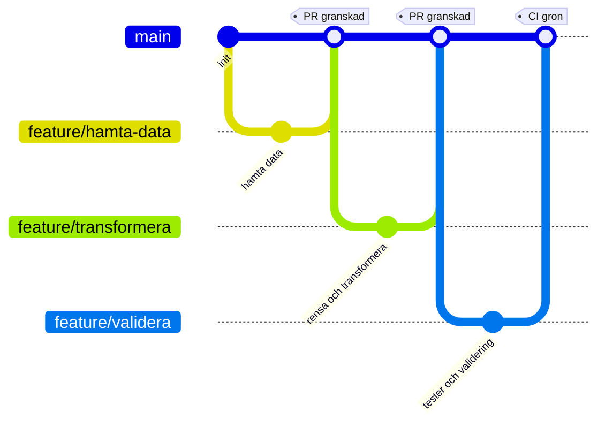

<div align="center">

# CI/CD Grupparbete

### Grupp 7 &nbsp;&bull;&nbsp; DevOps &nbsp;&bull;&nbsp; DE25

<p>


</p>

<em>Ett sammanhängande samarbetsprojekt där hela gruppen bygger en dataingestion pipeline tillsammans<br>
med parallella branches, pull requests, kodgranskning och en gemensam CI/CD pipeline.</em>

</div>

***

## Innehåll

1. [Syfte](#syfte)
2. [Mål](#mål)
3. [Tema](#tema)
4. [Arbetsflöde i Git](#arbetsflöde-i-git)
5. [Rollfördelning](#rollfördelning)
6. [Kom igång](#kom-igång)
7. [Secrets och lokal konfiguration](#secrets-och-lokal-konfiguration)
8. [CI/CD pipeline](#cicd-pipeline)
9. [Datakällor](#datakällor)
10. [Presentation, Lektion 8](#presentation-lektion-8)
11. [Bedömning](#bedömning)
12. [Gruppmedlemmar](#gruppmedlemmar)

***

## Syfte

Ge studenterna möjlighet att tillämpa kursens moment i ett sammanhängande, äkta samarbetsprojekt, alltså inte isolerade övningar, och öva verkligt teamarbete med Git och GitHub: parallella branches, pull requests, kodgranskning och en gemensam CI/CD pipeline.

***

## Mål

Vid presentationen ska gruppen kunna visa:

<table>
<tr>
<td width="34"><b>1</b></td>
<td>Ett GitHub repository med en <code>main</code> branch och en egen feature branch per gruppmedlem</td>
</tr>
<tr>
<td><b>2</b></td>
<td>En fungerande CI pipeline i GitHub Actions som automatiskt kör vid push och pull request</td>
</tr>
<tr>
<td><b>3</b></td>
<td>Korrekt hantering av secrets och lokal konfiguration via <code>.gitignore</code> och <code>.env</code>, utan att känslig information hamnar i repot</td>
</tr>
<tr>
<td><b>4</b></td>
<td>Ett fungerande samarbetsflöde: pull requests med granskning innan merge till <code>main</code></td>
</tr>
</table>

***

## Tema

Gruppen bygger en enkel dataingestion pipeline kring en valfri datakälla, till exempel ett öppet API, en CSV fil eller enkel webscraping.

**Krav**

* Kod versionshanteras i ett gemensamt GitHub repo
* En `main` branch plus en feature branch per gruppmedlem, naturligt uppdelat per steg i pipelinen
* `.gitignore` och `.env` används korrekt och skyddar till exempel nycklar till API eller uppgifter till en databas
* CI/CD pipeline som automatiskt kör lintning och tester vid push och pull request, till exempel tester i pytest som validerar att pipelinen producerar korrekt strukturerad data

**Valfritt**

* Schemaläggning och driftsättning är inget krav, men får gärna göras

***

## Arbetsflöde i Git



**Så jobbar vi**

1. Skapa din egen feature branch från `main`
2. Commita ofta och med tydliga meddelanden
3. Pusha upp branchen och öppna en pull request mot `main`
4. Vänta in CI, alla kontroller ska vara gröna
5. Be en gruppmedlem granska och godkänna
6. Merga till `main` och radera branchen

<details>
<summary><b>Kommandon steg för steg</b></summary>

```bash
git checkout main
git pull origin main
git checkout -b feature/mitt-omrade

git add .
git commit -m "Beskriv vad som gjorts"
git push -u origin feature/mitt-omrade
```

När en merge konflikt uppstår:

```bash
git checkout main
git pull origin main
git checkout feature/mitt-omrade
git merge main
# lös konflikterna i filerna, spara, och kör sedan
git add .
git commit
git push
```

</details>

> [!TIP]
> Gruppen bör medvetet dela en gemensam fil, till exempel `requirements.txt` eller en statusfil, så att merge konflikter uppstår naturligt och inte bara av tur.

***

## Rollfördelning

Arbetet delas upp per steg i pipelinen, en person per steg. Gruppen består av sex personer, därför är CI/CD och konfiguration egna ansvarsområden. Båda ingår i det som bedöms, och utan en tydlig ägare blir de lätt ingens ansvar.

<table>
<thead>
<tr><th align="left">Nr</th><th align="left">Steg</th><th align="left">Ansvar</th><th align="left">Branch</th><th align="left">Svårighetsgrad</th></tr>
</thead>
<tbody>
<tr><td><b>1</b></td><td><b>Hämta data</b></td><td>Anropa källan och spara rådata</td><td><code>feature/hamta-data</code></td><td>Lätt till medel</td></tr>
<tr><td><b>2</b></td><td><b>Rensa och transformera</b></td><td>Städa fält, typer och format</td><td><code>feature/transformera</code></td><td>Medel</td></tr>
<tr><td><b>3</b></td><td><b>Validera och testa</b></td><td>Tester i pytest och kontroll av struktur</td><td><code>feature/validera</code></td><td>Medel</td></tr>
<tr><td><b>4</b></td><td><b>Sammanställa resultat</b></td><td>Slutlig utdata och sammanfattning</td><td><code>feature/resultat</code></td><td>Lätt till medel</td></tr>
<tr><td><b>5</b></td><td><b>CI/CD pipeline</b></td><td>Bygga workflowen i GitHub Actions och få den grön</td><td><code>feature/ci</code></td><td>Medel till svår</td></tr>
<tr><td><b>6</b></td><td><b>Konfiguration och secrets</b></td><td>Hålla ihop <code>.env.example</code>, <code>.gitignore</code> och secrets i GitHub</td><td><code>feature/konfig</code></td><td>Lätt</td></tr>
</tbody>
</table>

**Ordning**

Steg 5 och 6 bör mergas först, helst redan första dagen. CI måste finnas på plats innan någon annans pull request kan bli grön. Därefter steg 1, och därnäst steg 2, 3 och 4 parallellt.

> [!NOTE]
> Svårighetsgraden påverkar inte betyget. Bedömningen gäller processen: egen branch, pull request med granskning, en löst merge konflikt och en grön CI körning. Den som tar det enklaste steget får samma G som den som tar det svåraste.

***

## Kom igång

```bash
git clone https://github.com/<organisation>/cicd-grupparbete-grupp7.git
cd cicd-grupparbete-grupp7

python -m venv .venv
source .venv/bin/activate        # Windows: .venv\Scripts\activate

pip install -r requirements.txt
cp .env.example .env             # fyll i dina egna värden
```

Kör pipelinen och testerna lokalt:

```bash
python -m src.main
pytest
```

***

## Secrets och lokal konfiguration

> [!IMPORTANT]
> Filen `.env` ska aldrig committas. Endast `.env.example` ligger i repot, och den innehåller tomma platshållare.

**`.env.example`**

```dotenv
API_KEY=
API_BASE_URL=
OUTPUT_PATH=data/output.json
```

**`.gitignore`**

```gitignore
.env
.venv/
__pycache__/
*.pyc
data/raw/
.pytest_cache/
```

Nycklar som behövs i CI läggs in under **Settings → Secrets and variables → Actions** i GitHub och läses in i workflowen som `${{ secrets.API_KEY }}`.

***

## CI/CD pipeline

Pipelinen körs automatiskt vid varje push och vid varje pull request mot `main`.

<table>
<thead>
<tr><th align="left">Steg</th><th align="left">Vad som händer</th><th align="left">Verktyg</th></tr>
</thead>
<tbody>
<tr><td><b>Checkout</b></td><td>Hämtar koden till körningen</td><td>actions/checkout</td></tr>
<tr><td><b>Setup</b></td><td>Installerar Python och beroenden</td><td>actions/setup&#8203;python</td></tr>
<tr><td><b>Lint</b></td><td>Kontrollerar kodstil och uppenbara fel</td><td>ruff eller flake8</td></tr>
<tr><td><b>Test</b></td><td>Kör testsviten och validerar datastrukturen</td><td>pytest</td></tr>
</tbody>
</table>

En pull request får mergas först när alla steg är gröna och en gruppmedlem har godkänt granskningen.

***

## Datakällor

Gruppen väljer **en** av dessa källor.

<table>
<thead>
<tr><th align="left">Källa</th><th align="left">Format</th><th align="left">Dokumentation</th></tr>
</thead>
<tbody>
<tr>
  <td><b>REST Countries</b></td><td>JSON</td>
  <td><a href="https://restcountries.com/docs/countries#list">restcountries.com</a></td>
</tr>
<tr>
  <td><b>PokéAPI</b></td><td>JSON</td>
  <td><a href="https://pokeapi.co/docs/v2">pokeapi.co</a>, leta gärna efter en version för Python, det finns publika repon</td>
</tr>
<tr>
  <td><b>CoinGecko</b></td><td>JSON</td>
  <td><a href="https://docs.coingecko.com/docs/setting-up-your-api-key">docs.coingecko.com</a>, gratis nyckel finns</td>
</tr>
<tr>
  <td><b>Trafiklab, SL med flera</b></td><td>JSON</td>
  <td><a href="https://www.trafiklab.se/sv/api/our-apis/sl/">trafiklab.se</a>, dokumentationen verkar vara på engelska</td>
</tr>
<tr>
  <td><b>Riksdagens öppna data</b></td><td>JSON</td>
  <td><a href="https://www.riksdagen.se/sv/dokument-och-lagar/riksdagens-oppna-data/">riksdagen.se</a></td>
</tr>
<tr>
  <td><b>SCB, Statistikmyndigheten</b></td><td>JSON</td>
  <td><a href="https://www.scb.se/vara-tjanster/oppna-data/">scb.se</a></td>
</tr>
<tr>
  <td><b>Nyheter via RSS</b></td><td>XML</td>
  <td>Den enda källan som inte är ett API i JSON, koden ser därför annorlunda ut, till exempel <code>feedparser</code> i stället för <code>requests</code></td>
</tr>
</tbody>
</table>

<details>
<summary><b>Flöden för nyheter via RSS</b></summary>

* SVT Nyheter: https://www.svt.se/nyheter/lokalt/jamtland/nyheterna-direkt-till-din-dator
* Dagens Nyheter: https://www.dn.se/rss/
* Aftonbladet: https://rss.aftonbladet.se/rss2/small/pages/sections/senastenytt/
* Expressen
* SvD

</details>

***

## Presentation, Lektion 8

En kort demo per grupp på cirka **20 minuter**:

1. Genomgång av repot
2. Historiken över branches
3. En granskning av en pull request i praktiken
4. CI pipelinen som körs live

Avsluta med en kort reflektion: vilka moment inom DevOps användes, och vilka utmaningar stötte gruppen på.

***

## Bedömning

**Grupparbete, betygsskala G eller IG.** För att få **G** behöver du delta i samtliga moment:

* [ ] Skapa en egen feature branch för din del av arbetet
* [ ] Genomföra din del av uppgiften, till exempel hämta data, rensa och transformera, validera och testa, eller sammanställa resultat
* [ ] Merga din feature branch till `main` efter granskning via pull request
* [ ] Hantera en merge konflikt om eller när en sådan uppstår under arbetets gång
* [ ] Delta i hanteringen av `.gitignore` och `.env`, antingen genom att själv konfigurera dem eller genom att aktivt bevittna och förstå hur gruppen gjort det
* [ ] Din pull request ska ha triggat en körning i CI, alltså lintning och tester, som blev grön innan merge

> [!NOTE]
> Datakvalitet och helhetslösning bedöms inte. Det avgörande är att du har deltagit i processen kring CI/CD.

***

## Gruppmedlemmar

<table>
<thead>
<tr><th align="left">Namn</th><th align="left">GitHub</th><th align="left">Ansvarsområde</th></tr>
</thead>
<tbody>
<tr><td></td><td></td><td>Hämta data</td></tr>
<tr><td></td><td></td><td>Rensa och transformera</td></tr>
<tr><td></td><td></td><td>Validera och testa</td></tr>
<tr><td></td><td></td><td>Sammanställa resultat</td></tr>
<tr><td></td><td></td><td>CI/CD pipeline</td></tr>
<tr><td></td><td></td><td>Konfiguration och secrets</td></tr>
</tbody>
</table>

<div align="center">
<sub>DevOps DE25 &nbsp;&bull;&nbsp; Grupp 7</sub>
</div>
