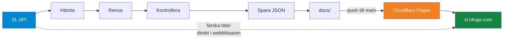
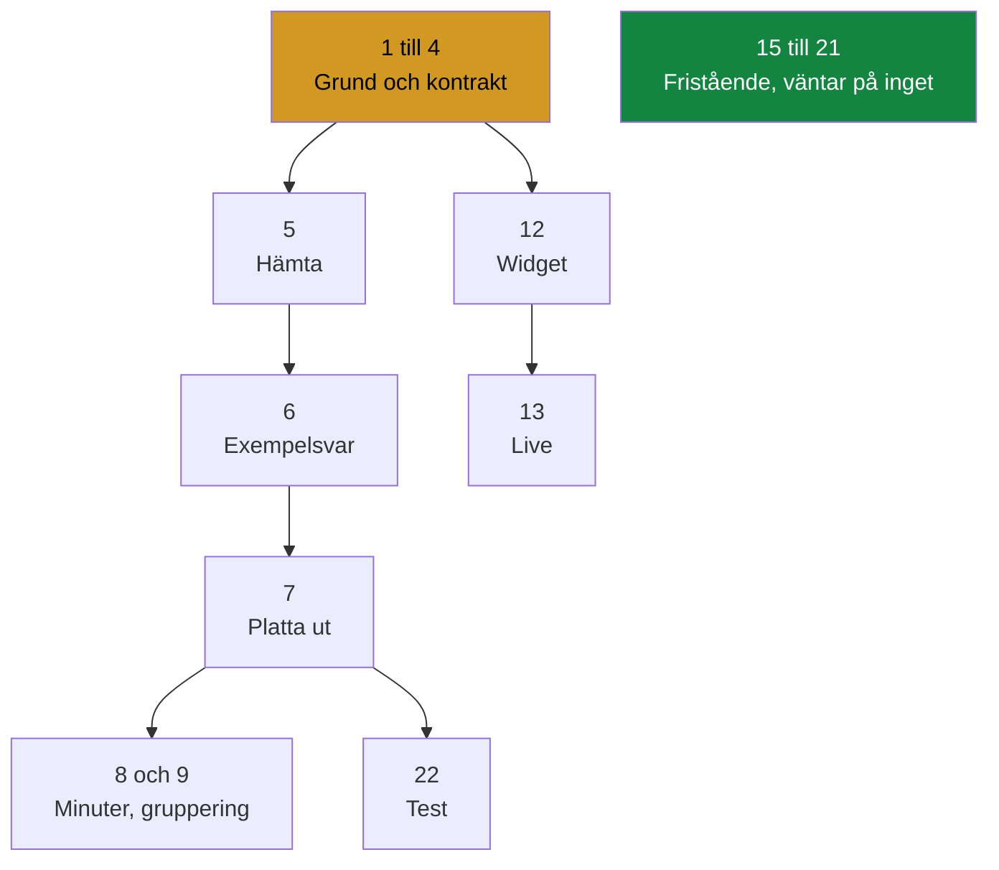

<div align="center">

# Förslag: Avgångstavlan

### Grupp 7 &nbsp;&bull;&nbsp; DevOps &nbsp;&bull;&nbsp; DE25

<p>


</p>

<em>En avgångstavla som visar när nästa buss, tunnelbana, pendeltåg, spårvagn<br>
och båt går från en vald hållplats i Stockholm.</em>

</div>

***

## Innehåll

1. [Vad vi bygger](#vad-vi-bygger)
2. [Så funkar det](#så-funkar-det)
3. [Datakällan](#datakällan)
4. [Arbetsfördelning](#arbetsfördelning)
5. [Ordning och beroenden](#ordning-och-beroenden)
6. [Så jobbar vi i Git](#så-jobbar-vi-i-git)
7. [Resten ligger i tavlan](#resten-ligger-i-tavlan)

***

## Vad vi bygger

En pipeline som hämtar avgångar från SL och en enkel sida som visar dem.

Slutresultatet är en tabell som ser ut ungefär så här:

<table>
<thead>
<tr><th align="left">Station</th><th align="left">Typ</th><th align="left">Linje</th><th align="left">Mot</th><th align="left">Klockan</th><th align="right">Minuter</th></tr>
</thead>
<tbody>
<tr><td>Slussen</td><td>Tunnelbana</td><td>17</td><td>Skarpnäck</td><td>10:43</td><td align="right">1</td></tr>
<tr><td>Slussen</td><td>Buss</td><td>2</td><td>Sofia</td><td>10:44</td><td align="right">2</td></tr>
<tr><td>Slussen</td><td>Pendelbåt</td><td>82</td><td>Djurgården</td><td>10:50</td><td align="right">8</td></tr>
</tbody>
</table>

> [!IMPORTANT]
> Uppgiften bedöms på **processen**, inte på hur avancerad koden är. Därför är varje uppgift medvetet liten. Alla ska hinna klart, förstå sin del och kunna förklara den på redovisningen.

De flesta uppgifter är ungefär **tio till femton rader kod**. Inget mer.

***

## Så funkar det



Fyra steg i Python, plus en webbsida som läser resultatet. CI kör lintning och tester automatiskt vid varje push, och varje merge till `main` publicerar om sidan.

Den streckade pilen är det som gör tavlan levande. Sidan är statisk, så webbläsaren hämtar färska avgångstider direkt från SL. **Ingen behöver ha en dator igång.**

***

## Datakällan

SL Transport hos Trafiklab. **Ingen API nyckel behövs**, vilket gör att alla kan börja direkt utan att vänta på inloggningar.

**Avgångar från en hållplats**

```
https://transport.integration.sl.se/v1/sites/9192/departures?forecast=30
```

`9192` är Slussen. Byt siffran för att byta hållplats.

**Hitta fler hållplatser**

```
https://transport.integration.sl.se/v1/sites?expand=true
```

<details>
<summary><b>Några hållplats id att börja med</b></summary>

<table>
<thead><tr><th align="left">Hållplats</th><th align="left">Id</th><th align="left">Innehåller</th></tr></thead>
<tbody>
<tr><td>T-Centralen</td><td><code>9001</code></td><td>Tunnelbana, alla tre linjer</td></tr>
<tr><td>Slussen</td><td><code>9192</code></td><td>Tunnelbana, buss, pendelbåt</td></tr>
<tr><td>Centralen</td><td><code>1002</code></td><td>Pendeltåg, tunnelbana, buss, spårväg</td></tr>
<tr><td>Gullmarsplan</td><td><code>9189</code></td><td>Tunnelbana, buss, Tvärbanan</td></tr>
<tr><td>Odenplan</td><td><code>9117</code></td><td>Tunnelbana, buss</td></tr>
</tbody>
</table>

</details>

### Fälten vi använder

Av allt som API:et skickar tillbaka behöver vi bara sex saker.

<table>
<thead>
<tr><th align="left">Vad vi vill visa</th><th align="left">Fält i svaret</th><th align="left">Exempel</th></tr>
</thead>
<tbody>
<tr><td>Station</td><td><code>stop_area.name</code></td><td>Slussen</td></tr>
<tr><td>Typ</td><td><code>line.transport_mode</code></td><td>METRO, BUS, TRAM, TRAIN, SHIP</td></tr>
<tr><td>Linje</td><td><code>line.designation</code></td><td>17</td></tr>
<tr><td>Linjefärg</td><td><code>line.group_of_lines</code></td><td>Tunnelbanans gröna linje</td></tr>
<tr><td>Mot</td><td><code>destination</code></td><td>Skarpnäck</td></tr>
<tr><td>Klockan</td><td><code>expected</code></td><td>2026-08-20T10:43:00</td></tr>
</tbody>
</table>

> [!WARNING]
> **Två fällor som vi redan har hittat i riktig data.**
>
> Det finns ett fält som heter `display`. Använd det inte. Det blandar `"Nu"`, `"3 min"` och `"13:25"` i samma svar, eftersom det växlar från minuter till klockslag efter ungefär tio minuter. Räkna ut minuterna själv från `expected`.
>
> Avgångar som redan har gått finns kvar i listan och ger **negativa minuter**. Det finns också ett fält `state` som kan vara `CANCELLED`. Vi filtrerar bort båda.

> [!NOTE]
> Tidigare stod här att listan inte kommer sorterad. **Det stämmer inte.** Tre riktiga svar har kontrollerats och alla var sorterade på `expected`. Det som ser osorterat ut är just `display`, av samma skäl som ovan.

***

## Arbetsfördelning

Vi har **inga fasta roller**. Arbetet ligger som en kö av små uppgifter, ett issue per uppgift, med korten i [projekttavlan](../../projects).

Var och en tar så många uppgifter hen vill, i sin egen takt. Dra ett kort till **In progress**, gör uppgiften i en egen branch, och skriv `Closes #16` i din pull request. Då stänger sig kortet självt när den mergas.

Beskrivningarna av alla uppgifter finns i [TASKS.md](TASKS.md).

<div align="center">

### [Öppna projekttavlan](../../projects) &nbsp;&bull;&nbsp; [Läs uppgifterna](TASKS.md)

</div>

> [!NOTE]
> Tidigare låg här ett förslag med sex fasta roller. Det byttes mot en uppgiftstavla eftersom en otagen roll blockerade allt nedanför sig. Nu kan de flesta uppgifter tas i vilken ordning som helst, och ingen fastnar för att någon annan inte hunnit.

***

## Ordning och beroenden

De flesta uppgifter har inga beroenden alls. Det här är de få som har det.



**Först:** uppgift 1 till 4. Christofer tar dem. CI måste finnas innan någon kan få en grön bock, och datakontraktet måste finnas innan någon kan producera data som passar.

**Sedan:** uppgift 5 och 6, eftersom exempelsvaret är det som låter alla andra jobba mot riktig datastruktur utan att gå mot nätverket.

**Parallellt, hela tiden:** uppgift 15 till 21. De väntar inte på någonting och går att ta redan idag.

> [!TIP]
> Fastnar allt annat går det alltid att ta en fristående uppgift. Det är hela poängen med att de finns.

***

## Så jobbar vi i Git

```bash
git checkout main
git pull origin main
git checkout -b task/16-linjefarger

# jobba, och committa ofta
git add .
git commit -m "Beskriv vad du gjort"
git push -u origin task/16-linjefarger
```

Branchen döps efter uppgiftens nummer och namn. Öppna sedan en pull request mot `main` med **`Closes #16`** i beskrivningen, vänta in CI, och be någon i gruppen granska.

När den mergas stängs issuet automatiskt, kortet flyttar sig till **Done**, och Cloudflare publicerar om sidan. Ingen behöver göra något efteråt.

> [!IMPORTANT]
> **Uppgift 28 tas av alla sex.** Var och en lägger till sin egen rad i tabellen `Gruppmedlemmar` i `README.md`, i sin egen branch. Det ger oss merge konflikter på riktigt, och att hantera en sådan är ett eget krav för G.

***

## Resten ligger i tavlan

Idéer för det vi gör om vi hinner mer, och checklistan för vad som faktiskt bedöms, ligger i [TASKS.md](TASKS.md). De stod tidigare även här, men två kopior av samma lista glider isär.

<div align="center">
<sub>DevOps DE25 &nbsp;&bull;&nbsp; Grupp 7 &nbsp;&bull;&nbsp; Förslag, inte beslut</sub>
</div>
