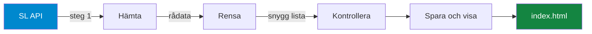
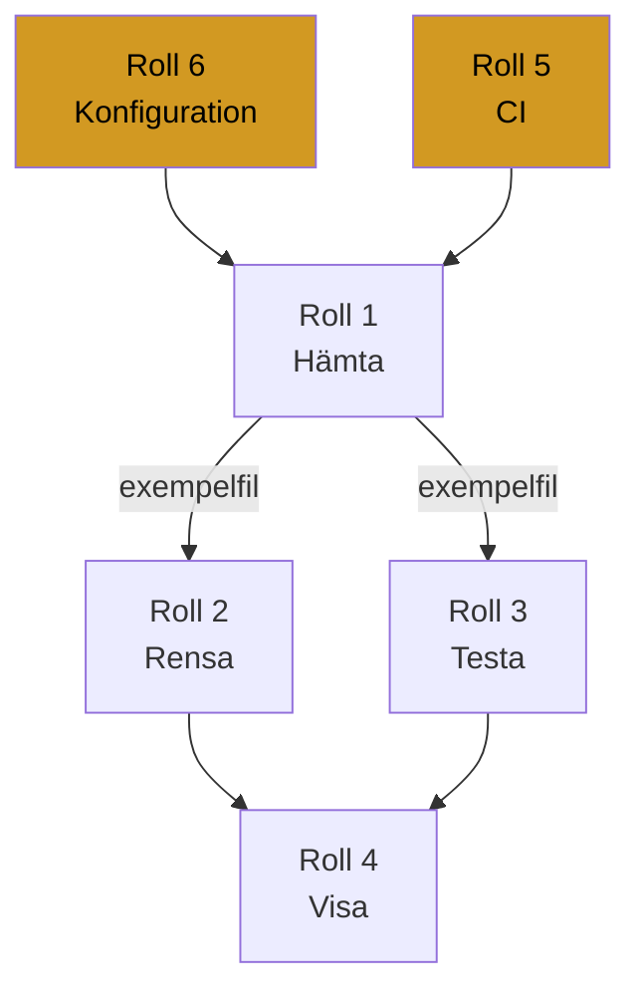

<div align="center">

# Förslag: Avgångstavlan

### Grupp 7 &nbsp;&bull;&nbsp; DevOps &nbsp;&bull;&nbsp; DE25

<p>


</p>

<em>En avgångstavla som visar när nästa buss, tunnelbana, pendeltåg, spårvagn<br>
och båt går från en vald hållplats i Stockholm.</em>

</div>

***

## Innehåll

1. [Vad vi bygger](#vad-vi-bygger)
2. [Så funkar det](#så-funkar-det)
3. [Datakällan](#datakällan)
4. [Rollfördelning](#rollfördelning)
5. [Vad varje roll gör](#vad-varje-roll-gör)
6. [Ordning och beroenden](#ordning-och-beroenden)
7. [Så jobbar vi i Git](#så-jobbar-vi-i-git)
8. [Om vi hinner mer](#om-vi-hinner-mer)
9. [Checklista för G](#checklista-för-g)

***

## Vad vi bygger

En pipeline som hämtar avgångar från SL och en enkel sida som visar dem.

Slutresultatet är en tabell som ser ut ungefär så här:

<table>
<thead>
<tr><th align="left">Station</th><th align="left">Typ</th><th align="left">Linje</th><th align="left">Mot</th><th align="left">Klockan</th><th align="right">Minuter</th></tr>
</thead>
<tbody>
<tr><td>Slussen</td><td>Tunnelbana</td><td>17</td><td>Skarpnäck</td><td>10:43</td><td align="right">1</td></tr>
<tr><td>Slussen</td><td>Buss</td><td>2</td><td>Sofia</td><td>10:44</td><td align="right">2</td></tr>
<tr><td>Slussen</td><td>Pendelbåt</td><td>82</td><td>Djurgården</td><td>10:50</td><td align="right">8</td></tr>
</tbody>
</table>

> [!IMPORTANT]
> Uppgiften bedöms på **processen**, inte på hur avancerad koden är. Därför är varje roll medvetet liten. Alla ska hinna klart, förstå sin del och kunna förklara den på redovisningen.

Varje roll är ungefär **tio till trettio rader kod**. Inget mer.

***

## Så funkar det



Fyra steg i Python, plus en webbsida som läser resultatet. CI kör lintning och tester automatiskt vid varje push.

***

## Datakällan

SL Transport hos Trafiklab. **Ingen API nyckel behövs**, vilket gör att alla kan börja direkt utan att vänta på inloggningar.

**Avgångar från en hållplats**

```
https://transport.integration.sl.se/v1/sites/9192/departures?forecast=30
```

`9192` är Slussen. Byt siffran för att byta hållplats.

**Hitta fler hållplatser**

```
https://transport.integration.sl.se/v1/sites?expand=true
```

<details>
<summary><b>Några hållplats id att börja med</b></summary>

<table>
<thead><tr><th align="left">Hållplats</th><th align="left">Id</th><th align="left">Innehåller</th></tr></thead>
<tbody>
<tr><td>T-Centralen</td><td><code>9001</code></td><td>Tunnelbana, alla tre linjer</td></tr>
<tr><td>Slussen</td><td><code>9192</code></td><td>Tunnelbana, buss, pendelbåt</td></tr>
<tr><td>Centralen</td><td><code>1002</code></td><td>Pendeltåg, tunnelbana, buss, spårväg</td></tr>
<tr><td>Gullmarsplan</td><td><code>9189</code></td><td>Tunnelbana, buss, Tvärbanan</td></tr>
<tr><td>Odenplan</td><td><code>9117</code></td><td>Tunnelbana, buss</td></tr>
</tbody>
</table>

</details>

### Fälten vi använder

Av allt som API:et skickar tillbaka behöver vi bara sex saker.

<table>
<thead>
<tr><th align="left">Vad vi vill visa</th><th align="left">Fält i svaret</th><th align="left">Exempel</th></tr>
</thead>
<tbody>
<tr><td>Station</td><td><code>stop_area.name</code></td><td>Slussen</td></tr>
<tr><td>Typ</td><td><code>line.transport_mode</code></td><td>METRO, BUS, TRAM, TRAIN, SHIP</td></tr>
<tr><td>Linje</td><td><code>line.designation</code></td><td>17</td></tr>
<tr><td>Linjefärg</td><td><code>line.group_of_lines</code></td><td>Tunnelbanans gröna linje</td></tr>
<tr><td>Mot</td><td><code>destination</code></td><td>Skarpnäck</td></tr>
<tr><td>Klockan</td><td><code>expected</code></td><td>2026-08-20T10:43:00</td></tr>
</tbody>
</table>

> [!WARNING]
> **Tre fällor som vi redan har hittat i riktig data.**
>
> Det finns ett fält som heter `display`. Använd det inte. Det blandar `"Nu"`, `"3 min"` och `"10:40"` i samma svar. Räkna ut minuterna själv från `expected`.
>
> Listan kommer **inte** sorterad i tidsordning. Vi sorterar själva.
>
> Avgångar som redan har gått finns kvar i listan och ger **negativa minuter**. Det finns också ett fält `state` som kan vara `CANCELLED`. Vi filtrerar bort båda.

***

## Rollfördelning

<table>
<thead>
<tr><th align="left">Nr</th><th align="left">Roll</th><th align="left">Branch</th><th align="left">Svårighet</th><th align="left">Ungefärlig storlek</th></tr>
</thead>
<tbody>
<tr><td><b>1</b></td><td><b>Hämta data</b></td><td><code>feature/hamta-data</code></td><td>Lätt</td><td>10 rader</td></tr>
<tr><td><b>2</b></td><td><b>Rensa och transformera</b></td><td><code>feature/transformera</code></td><td>Medel</td><td>25 rader</td></tr>
<tr><td><b>3</b></td><td><b>Validera och testa</b></td><td><code>feature/validera</code></td><td>Lätt till medel</td><td>3 tester</td></tr>
<tr><td><b>4</b></td><td><b>Sammanställa och visa</b></td><td><code>feature/resultat</code></td><td>Medel</td><td>20 rader plus html</td></tr>
<tr><td><b>5</b></td><td><b>CI/CD pipeline</b></td><td><code>feature/ci</code></td><td>Medel</td><td>25 rader yaml</td></tr>
<tr><td><b>6</b></td><td><b>Konfiguration och secrets</b></td><td><code>feature/konfig</code></td><td>Lätt</td><td>10 rader</td></tr>
</tbody>
</table>

> [!NOTE]
> Svårighetsgraden påverkar inte betyget. Den som tar den enklaste rollen får samma G som den som tar den svåraste, så länge alla går igenom hela flödet med branch, pull request, granskning och grön CI.

***

## Vad varje roll gör

<details open>
<summary><b>Roll 1: Hämta data</b> &nbsp;&bull;&nbsp; <code>src/hamta.py</code></summary>

<br>

**Mål**

En funktion som ringer SL och lämnar tillbaka svaret som en Python dictionary.

**Att göra**

1. Använd `requests` för att hämta adressen med hållplatsens id
2. Sätt en timeout så programmet inte hänger sig om SL är nere
3. Kontrollera att svaret blev 200, annars ge ett tydligt felmeddelande
4. Spara en kopia av det orörda svaret i mappen `data/raw/`
5. Returnera svaret

**Klart när**

Du kan köra funktionen och få tillbaka en dictionary som innehåller nyckeln `departures` med en lista i.

> [!TIP]
> Spara ett exempelsvar som en fil i `tests/exempel/` och committa den. Roll 3 behöver den för att kunna testa utan internet, och roll 2 behöver den för att veta hur datan ser ut.

</details>

<details>
<summary><b>Roll 2: Rensa och transformera</b> &nbsp;&bull;&nbsp; <code>src/transformera.py</code></summary>

<br>

**Mål**

Ta emot den stora röriga dictionaryn och lämna tillbaka en enkel lista med bara det vi vill visa.

**Att göra**

1. Gå igenom varje avgång i `departures`
2. Plocka ut station, typ, linje, destination och tidpunkt enligt tabellen ovan
3. Räkna ut hur många minuter det är kvar, från `expected` minus tiden just nu
4. Gör om `expected` till en klocksträng med bara timme och minut
5. Översätt typen till svenska, alltså `METRO` blir Tunnelbana, `BUS` blir Buss och så vidare
6. Hoppa över avgångar där `state` är `CANCELLED`
7. Hoppa över avgångar med negativa minuter
8. Sortera listan så att den som går snart kommer först

**Klart när**

Du får tillbaka en lista med dictionaries som bara innehåller de sex fälten, sorterade i tidsordning.

</details>

<details>
<summary><b>Roll 3: Validera och testa</b> &nbsp;&bull;&nbsp; <code>tests/test_pipeline.py</code></summary>

<br>

**Mål**

Bevisa att roll 2 gör rätt, utan att någonsin ringa SL.

**Att göra**

Skriv tre tester som utgår från exempelfilen som roll 1 sparade.

1. Att varje post innehåller alla sex fälten
2. Att listan är sorterad, alltså att minuterna aldrig minskar när man går framåt i listan
3. Att inga minuter är negativa och att inget är inställt

**Klart när**

`pytest` blir grönt och funkar även med nätverket avstängt.

> [!IMPORTANT]
> Testerna får aldrig ringa SL på riktigt. Då blir CI rött så fort SL har en dålig dag, och vår gröna körning blir en slump i stället för ett bevis.

</details>

<details>
<summary><b>Roll 4: Sammanställa och visa</b> &nbsp;&bull;&nbsp; <code>src/resultat.py</code> och <code>docs/index.html</code></summary>

<br>

**Mål**

Spara resultatet och visa det för en människa.

**Att göra**

1. Skriv listan till en JSON fil, sökvägen kommer från konfigurationen
2. Skriv också ut en enkel tabell i terminalen så man ser att det funkar
3. Bygg en `index.html` som läser JSON filen och visar den som en tabell
4. Färglägg linjenumret utifrån `group_of_lines`, alltså grön, röd eller blå för tunnelbanan och blå för Blåbuss

**Klart när**

Du kan öppna sidan i webbläsaren och se avgångarna i en tabell.

> [!TIP]
> Sidan behöver varken ramverk eller byggsteg. En html fil med lite css och några rader javascript räcker gott.

</details>

<details>
<summary><b>Roll 5: CI/CD pipeline</b> &nbsp;&bull;&nbsp; <code>.github/workflows/ci.yml</code></summary>

<br>

**Mål**

Att lintning och tester körs automatiskt vid varje push och varje pull request.

**Att göra**

1. Skapa mappen `.github/workflows/` och filen `ci.yml` i den
2. Låt den trigga på push till alla brancher och på pull request mot `main`
3. Stegen är: checka ut koden, installera Python, installera från `requirements.txt`, kör `ruff check .`, kör `pytest`

**Klart när**

Det syns en grön bock på din pull request.

> [!WARNING]
> `pytest` avslutas med felkod 5 när den inte hittar några tester alls, och då blir CI rött. Lägg därför med minst ett litet test i samma pull request som workflowen, även om det bara är ett `assert True` som roll 3 byter ut sedan.

</details>

<details>
<summary><b>Roll 6: Konfiguration och secrets</b> &nbsp;&bull;&nbsp; <code>src/config.py</code>, <code>.env.example</code>, <code>.gitignore</code></summary>

<br>

**Mål**

Att hållplats och inställningar går att ändra utan att röra koden, och att inget känsligt hamnar i repot.

**Att göra**

1. Fyll på `.env.example` med `SITE_ID`, `SITE_NAME`, `FORECAST_MINUTES` och `OUTPUT_PATH`
2. Skriv `config.py` som läser dessa med `python-dotenv` och har vettiga standardvärden
3. Kontrollera att `.gitignore` stoppar `.env`, `.venv/` och `data/raw/`
4. Visa resten av gruppen hur man kopierar `.env.example` till `.env`

**Klart när**

Pipelinen går att köra även utan `.env`, tack vare standardvärdena. Det är viktigt, för CI har ingen `.env` fil.

> [!NOTE]
> Det här API:et behöver ingen nyckel, så vi har ingen riktig hemlighet att skydda. Bedömningen handlar om att vi förstår och hanterar `.env` och `.gitignore`, och det gör vi ändå.

</details>

***

## Ordning och beroenden



**Dag ett:** roll 5 och roll 6 mergas först. CI måste finnas innan någon annan kan få en grön bock, och konfigurationen behövs av alla.

**Dag två:** roll 1, eftersom roll 2 och roll 3 behöver se hur datan faktiskt ser ut.

**Sedan:** roll 2, 3 och 4 parallellt. Så fort roll 1 har committat exempelfilen kan alla tre jobba samtidigt.

> [!TIP]
> Ingen behöver sitta och vänta. Roll 3 och roll 4 kan börja mot exempelfilen långt innan roll 2 är klar.

***

## Så jobbar vi i Git

```bash
git checkout main
git pull origin main
git checkout -b feature/min-roll

# jobba, och committa ofta
git add .
git commit -m "Beskriv vad du gjort"
git push -u origin feature/min-roll
```

Öppna sedan en pull request mot `main`, vänta in CI, och be någon i gruppen granska.

> [!IMPORTANT]
> Alla ska lägga till sitt eget beroende i `requirements.txt`, även om det redan står där. Det ger oss merge konflikter på riktigt, och att hantera en sådan är ett eget krav för G.

***

## Om vi hinner mer

Helt frivilligt, och inget av det påverkar betyget.

<table>
<thead><tr><th align="left">Idé</th><th align="left">Vad det ger</th></tr></thead>
<tbody>
<tr><td>Sidan uppdaterar sig själv var trettionde sekund</td><td>En riktig avgångstavla i stället för en ögonblicksbild</td></tr>
<tr><td>Visa försening genom att jämföra <code>scheduled</code> och <code>expected</code></td><td>Man ser vilka avgångar som är sena</td></tr>
<tr><td>Rullgardin för att byta hållplats</td><td>Slipper redigera <code>.env</code></td></tr>
<tr><td>Schemalagd körning i GitHub Actions</td><td>Det valfria momentet schemaläggning</td></tr>
<tr><td><code>ruff format --check</code> som eget steg i CI</td><td>Slut på diskussioner om kodstil</td></tr>
</tbody>
</table>

***

## Checklista för G

Var och en fyller i sin egen rad. Detta är det som faktiskt bedöms.

<table>
<thead>
<tr><th align="left">Krav</th><th align="left">Hur du visar det</th></tr>
</thead>
<tbody>
<tr><td>Egen feature branch</td><td>Din branch syns i historiken</td></tr>
<tr><td>Genomfört din del</td><td>Dina commits på din branch</td></tr>
<tr><td>Mergad via granskad pull request</td><td>Någon i gruppen har godkänt din PR</td></tr>
<tr><td>Hanterat en merge konflikt</td><td>Troligen i <code>requirements.txt</code></td></tr>
<tr><td>Deltagit i <code>.gitignore</code> och <code>.env</code></td><td>Antingen skrivit dem eller förstått hur roll 6 gjorde</td></tr>
<tr><td>Grön CI på din pull request</td><td>Grön bock på PR sidan</td></tr>
</tbody>
</table>

> [!NOTE]
> Datakvalitet och helhetslösning bedöms inte. Det avgörande är att du har deltagit i processen kring CI/CD.

<div align="center">
<sub>DevOps DE25 &nbsp;&bull;&nbsp; Grupp 7 &nbsp;&bull;&nbsp; Förslag, inte beslut</sub>
</div>
